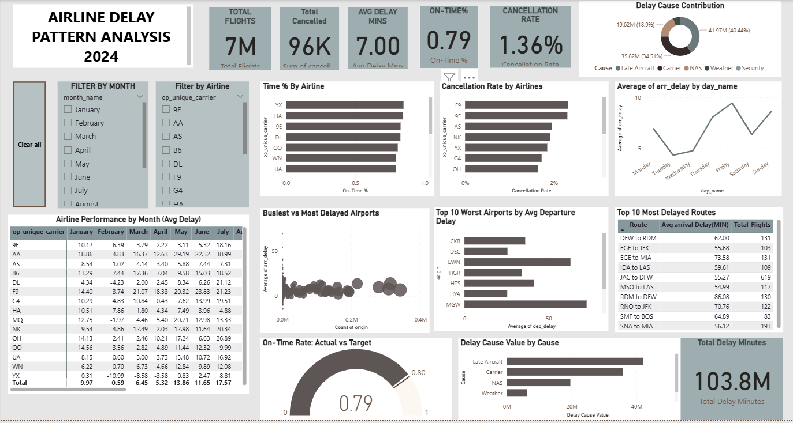
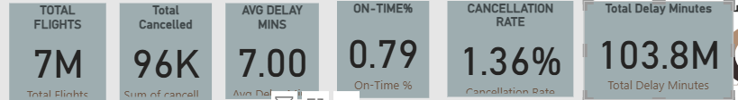
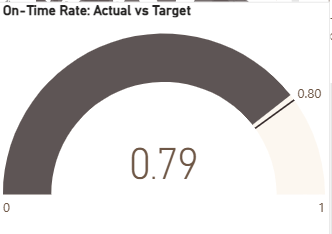
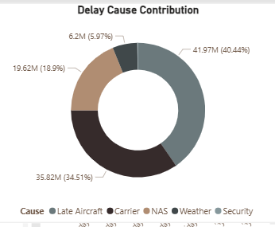

# ✈️ Airline Delay Pattern Analysis — 2024

End-to-end analysis of 7.06 million U.S. domestic flights in 2024 — uncovering what actually drives flight delays and translating findings into data-backed business recommendations.

**Tech Stack:** Python • MySQL • Power BI • DAX

---

## 🎯 Project Objective

Flight delays affect millions of travelers every year and generate rich, real-world data — making this an ideal dataset for practicing end-to-end analytics, from raw data to business impact. Airlines lose significant time and money to delays, but not all delays share the same cause, and not all causes are equally fixable. This project analyzes a full year of U.S. domestic flight data to answer:

- What's actually driving delays — operational issues, or weather?
- Which airlines, airports, and routes consistently underperform?
- When are delays most likely, by day and by month?
- What specific actions would reduce delays most effectively?

The project covers the full analytics lifecycle: data cleaning in Python, relational analysis in SQL, an interactive Power BI dashboard, and a set of actionable business recommendations.

---

## 📁 Dataset

- **Source:** [Kaggle — Flight Delay Dataset 2024](https://www.kaggle.com/datasets/hrishitpatil/flight-data-2024) (CC0 Public Domain)
- **Size:** 7,061,582 rows × 42 columns (35 original + 7 engineered)
- **Engineered features:** `month_name`, `day_name`, `quarter`, `total_delay`, `is_delayed`, `delay_severity`, `route`

---

## 🛠️ Tech Stack & Tools

| Category | Tools |
|---|---|
| Data Cleaning & EDA | Python (Pandas, NumPy), Google Colab |
| Visualization | Matplotlib, Seaborn |
| Database | MySQL Workbench |
| BI Dashboard | Power BI Desktop, DAX, Power Query |
| Documentation | GitHub, PowerPoint, Word |

---

## 🔑 Key Performance Indicators

| Metric | Value |
|---|---|
| Total Flights | 7,061,582 |
| On-Time Rate | 78.78% |
| Avg Arrival Delay | 7.00 minutes |
| Cancellation Rate | 1.36% |
| Total Delay Minutes | 103.6M |

---

## 📈 Key Findings

**1. Delays are largely operational, not weather-driven**
Late Aircraft (40.4%) and Carrier delays (34.5%) account for ~75% of all delay minutes, while Weather (5.97%) and Security (0.17%) are minor contributors — meaning most delay causes are within an airline's control to fix.

**2. Airline performance varies sharply**
- Best on-time performance: **YX (Republic Airways)** — 84.82%
- Worst on-time performance: **F9 (Frontier)** — 70.29%
- F9 also posts the worst cancellation rate (2.32%) — a consistent gap across two independent metrics, pointing to a systemic issue rather than a one-off.

**3. Clear, predictable time-based patterns**
- Worst day: **Friday** (22.61% delay rate)
- Best day: **Tuesday** (17.32% delay rate)
- Worst month: **July** (28.87% delay rate)
- Calmest months: **September–November**

**4. Airport traffic volume does not predict delay severity**
Major hubs (ATL, DFW, ORD) are *not* among the most delayed airports. DFW ranks #2 in flight volume but only #48 in average delay — confirming that congestion alone isn't the main driver of delays.

---

## 📊 Interactive Dashboard

**Built in Power BI** with 6 KPI cards, clustered bar charts, a line chart, scatter plot, gauge chart, matrix heatmap, and donut chart — fully interactive with slicers (Airline, Month), cross-filtering, custom tooltips, and a reset-filters button.

| KPI Summary | On-Time Gauge & Monthly Heatmap | Delay Cause Breakdown |
|---|---|---|
|  |  |  |

📥 **[Download the full interactive dashboard (.pbix, ~184MB)](powerbi/airline_delay_pattern_analysis.pbix)** — open in Power BI Desktop (free) to explore every visual, slicer, and filter yourself.

---

## 💡 Business Recommendations

1. **Prioritize turnaround-time and crew-scheduling improvements over weather mitigation investment.** Late Aircraft + Carrier delays drive ~75% of delay minutes — far more than weather or security combined.

2. **Increase staffing and ground resources on Fridays and Sundays.** These days consistently show the highest delay rates across the year.

3. **Conduct targeted root-cause reviews for chronically delayed regional routes and airports** (e.g., RDM–DFW at 86 min avg delay, HTS at 42.79 min avg delay) — these patterns suggest fixable local issues, not random variance.

4. **Initiate a cross-functional operational review for Frontier (F9).** Its consistently poor performance across both on-time rate and cancellation rate signals a systemic issue, not an isolated cause.

5. **Maintain current infrastructure investment at major hubs; redirect incremental budget toward regional route reliability**, since high-traffic hubs already perform adequately.

📑 *Full presentation with supporting visuals: [Airline_Delay_Pattern_Analysis.pptx](presentation/)*

---

## 🔍 Methodology

1. **Data Cleaning (Python):** Handled nulls and duplicates, fixed date formats, engineered 7 new features, validated data integrity across 7M+ rows.
2. **SQL Analysis (MySQL):** Loaded the full dataset via `LOAD DATA INFILE`, wrote 10 analytical queries covering airline performance, route/airport delay patterns, delay-cause breakdowns, and time-based trends — including a CTE with window functions and a reusable SQL `VIEW`.
3. **Power BI Dashboard:** Connected live to MySQL, built 10 custom DAX measures, and designed an interactive dashboard spanning 8+ visual types.
4. **Cross-Validation:** Verified every key metric (delay rate, cancellation rate, average delay) matched exactly between the Python and SQL layers — confirming the analysis is accurate and internally consistent.

---

## 🚀 Future Work

- **Publish a live, browser-based version of the dashboard** — current version requires downloading the .pbix file; a hosted version would remove that friction
- **Build a predictive delay-risk model** using historical patterns (e.g., predicting delay probability by route, airline, and season)
- **Extend to multi-year data** to validate seasonal patterns and detect year-over-year trends
- **Automate data refresh** so the dashboard updates on a schedule rather than requiring manual reload
- **Add weather data integration** (e.g., NOAA) to quantify weather's true contribution to delays beyond the dataset's existing weather-delay column

## 👤 About the Author

**Yarramsetti Rama Sri Sahithi**
Data Analyst | Hyderabad, India

🔗 [GitHub](https://github.com/ramasrisahithi) • ✉️ sahithiyarramsetti011@gmail.com
